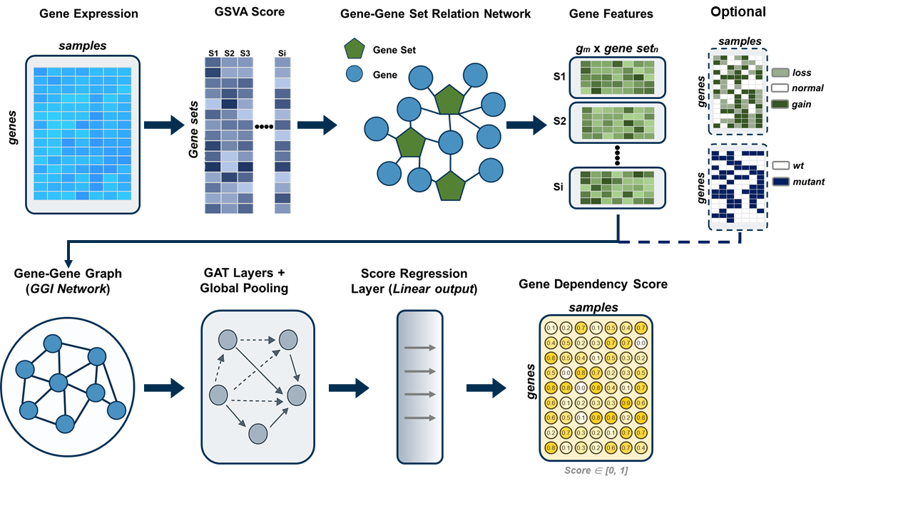

# GATDep

This repository contains the data and code related to the GATDep model.

## datasets
Datasets required for model training and downstream analyses.

## trained_models
Trained model checkpoints and corresponding log files for different runs.

## GAT_Rscripts.ipynb
R-based analysis scripts relevant to the GATDep study.

## GATDep.ipynb
The main notebook, which includes data preprocessing, model construction, training, and application of the GATDep model.