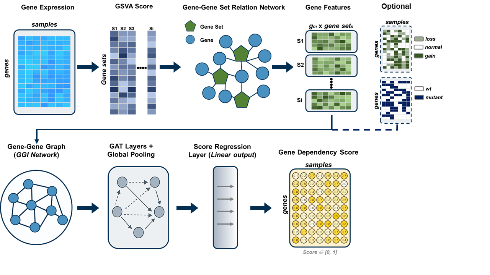

#   GATDep: Context-aware Gene Dependency Prediction via Graph Attention Networks

[](LICENSE)
[]()
[]()

---

##   Overview

**GATDep** (Gene Dependency Graph Attention Network) is a **context-aware, node-level regression framework** for modeling **gene dependency** in cancer cell lines.  
It integrates multi-omics features (transcriptomics, mutation, copy number, etc.) and **gene-gene interaction networks** to predict **CRISPR dependency scores** while maintaining interpretability through attention mechanisms and GNNExplainer.

This repository provides:
- Implementation of the **GATDep model** in [PyTorch Geometric](https://pytorch-geometric.readthedocs.io/)
- Scripts for **data preprocessing**, **model training**, **evaluation**, and **explainability analysis**
- Example notebooks reproducing the results in our manuscript  
  > *Context-aware gene dependency modeling via graph attention networks for precision oncology*

---

##   Model Architecture

<p align="center">
  
</p>

GATDep models gene dependencies using:
- **Graph Attention Layers (GATConv)** to capture local gene interactions  
- **Context embedding module** for cell-line-specific features  
- **Node-level regression head** to predict gene dependency scores  
- **Explainability module** via *GNNExplainer* and attention weights

---

##  Installation

### 1. Clone the repository
```bash
git clone https://github.com/yourusername/GATDep.git
cd GATDep
```

### Create a conda environment

```bash
conda  env ceate -f environment.yml
```

### Install dependencies

```bash
pip install -r requirements.txt

```

Main dependencies:

+ torch >= 2.0

+ torch-geometric == 2.6.1

+ pandas, numpy, scikit-learn

+ matplotlib, seaborn

+ tqdm, networkx


## Usage

### gene expression to GSVA scores

```bash
Rscript geneExpression2GSVA.R example_data/example_expression.csv
#output: gsva_score_go_kegg.txt
```

### Predictions of gene essentialities


```bash

python GATDep.py --gsva gsva_score_go_kegg.txt --out gsva_score_go_kegg_results

``` 

## 🔗 Reference

If you use this repository, please cite:

```
@article{Ming2025GATDep,
  title={Context-aware gene dependency modeling via graph attention networks for precision oncology},
  author={},
  year={2025},
  journal={},
}
```

##  🧰 Acknowledgments

This implementation is built upon:

+ PyTorch Geometric

+ DepMap Public dataset

+ STRING database

+ GNNExplainer


## 📜 License

This project is licensed under the MIT License.
 
## ✉️ Contact

For questions, pleas contact dongliulou@126.com or open an issue in this repository.
 